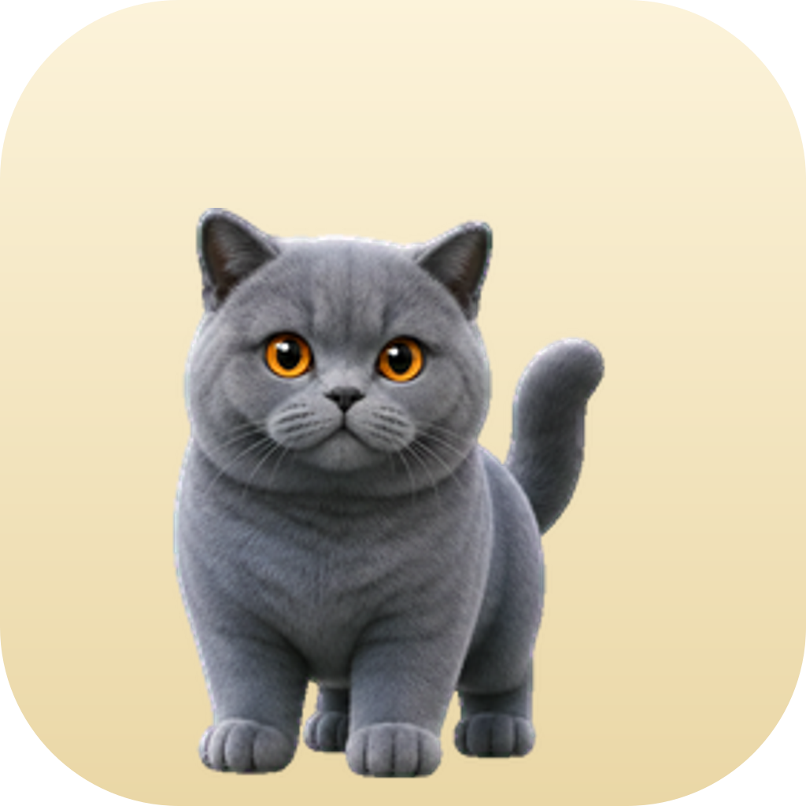

<p align="center">
  
</p>

<h1 align="center">Draco · mascotte-claude 🐱</h1>

<p align="center">
  A cute desktop cat pet for macOS that chats with your <b>Claude Code</b> session — fully local, no API.<br>
  Un simpatico gatto desktop per macOS che chatta con la tua sessione <b>Claude Code</b> — tutto locale, senza API.
</p>

<p align="center">
  <a href="#-english">English</a> · <a href="#-italiano">Italiano</a> · <a href="CONTRIBUTING.md">Contribute / Contribuisci</a>
</p>

---

## 🇬🇧 English

**Draco** is a floating British-Shorthair-cat mascot that lives on your desktop. Click it to open a little
chat panel wired to your **real Claude Code web session** (embedded in a hidden window). You type, Claude
answers, and Draco reacts — thinking, celebrating, following your cursor. No API keys, nothing leaves your Mac
except your normal chat with Claude.

### Features
- 🐾 **Floating mascot** — move it anywhere, snaps nicely into screen corners to save space
- 💬 **Chat in speech bubbles** — a real back-and-forth chat panel with history
- ↕️ **Expandable chat** — up/down arrows show more/fewer recent messages
- 🖐️ **Drag & run** — grab the cat and it runs in the direction you drag
- 👀 **Gaze tracking** — 16-direction head/eyes that follow your mouse
- 📏 **Resizable** — right-click → size 50%–200% (persisted)
- 🔗 **Switch session** — right-click → change the Claude session URL without logging in again
- 📌 Always-on-top, launch at login, all local

### Requirements
- macOS (Apple Silicon or Intel)
- [Node.js](https://nodejs.org) 18+

### Install & run
```bash
git clone https://github.com/ivanmosetti07/mascotte-claude.git
cd mascotte-claude
npm install
npm start          # run in dev
```
Build a double-clickable app:
```bash
npm run dist       # creates dist/mac-*/Draco.app
# the app is ad-hoc signed for local use; if macOS complains, right-click the app → Open
codesign --force --deep --sign - "dist/mac-arm64/Draco.app"   # re-sign if needed
```

### First login — use EMAIL
On first run a Claude login window appears. **Sign in with email** (not passkey, not Google):
1. Click **“Continue with email”**, enter your email.
2. Open the **“Secure link to log in to Claude.ai”** email.
3. If it has a **code**, paste it in the window. If it has a **link**, copy it and use
   **right-click on Draco → “Paste login link”** so it opens in the app (same persistent session).

Why not passkey/Google? The login runs inside an embedded browser (Electron). Passkeys (Touch ID/iCloud)
need native OS integration that only real browsers have, and Google blocks embedded webviews. Email works.
Your login is stored **locally only** and is never part of this repo.

### How it works (honest)
The chat runs in a hidden window loading `claude.ai/code`. Draco reads the page to detect when Claude is
typing and to pull the reply text — a **heuristic** based on claude.ai's current DOM. If Claude changes its
UI, the selectors in `main.js` (`POLL` / `injectScript`) may need a tweak. PRs welcome.

---

## 🇮🇹 Italiano

**Draco** è una mascotte (gatto British Shorthair) che galleggia sul desktop. Cliccala per aprire un
pannello chat collegato alla tua **sessione Claude Code reale** (in una finestra nascosta). Scrivi, Claude
risponde, e Draco reagisce — pensa, festeggia, ti segue con lo sguardo. Nessuna API, niente esce dal tuo
Mac se non la tua normale chat con Claude.

### Funzioni
- 🐾 **Mascotte flottante** — spostala dove vuoi, si aggancia agli angoli per non occupare spazio
- 💬 **Chat a nuvolette** — un vero botta e risposta con lo storico
- ↕️ **Chat espandibile** — le frecce su/giù mostrano più o meno messaggi
- 🖐️ **Trascina & corri** — afferra il gatto e corre nella direzione del trascinamento
- 👀 **Sguardo** — testa/occhi a 16 direzioni che seguono il mouse
- 📏 **Ridimensionabile** — clic destro → dimensione 50%–200% (persistente)
- 🔗 **Cambia sessione** — clic destro → cambia l'URL della sessione Claude senza rifare login
- 📌 Sempre in primo piano, avvio all'accensione, tutto locale

### Requisiti
- macOS (Apple Silicon o Intel)
- [Node.js](https://nodejs.org) 18+

### Installazione e avvio
```bash
git clone https://github.com/ivanmosetti07/mascotte-claude.git
cd mascotte-claude
npm install
npm start          # avvia in sviluppo
npm run dist       # crea dist/mac-*/Draco.app
```
L'app è firmata solo ad-hoc per uso locale: se macOS si lamenta, **clic destro sull'app → Apri**.

### Primo login — usa l'EMAIL
Al primo avvio compare la finestra di login di Claude. **Accedi con l'email** (non passkey, non Google):
clic su **“Continua con email”**, poi apri la mail **“Secure link to log in to Claude.ai”** e incolla il
**codice** nella finestra, oppure copia il **link** e usa **clic destro su Draco → “Incolla link di login”**.
Le passkey non compaiono perché il login gira in un browser incorporato (limite noto di Electron); l'email
funziona. Il login resta salvato **solo in locale** e non finisce mai nel repo.

---

## 🤝 Contribuisci / Contribute

Vuoi creare **la tua mascotte** (un cane, un drago, un robot…) o migliorare Draco? Sì, per favore! 🎉
Want to make **your own mascot** or improve Draco? Yes please! See **[CONTRIBUTING.md](CONTRIBUTING.md)**
for the sprite-sheet format and ideas (mascot picker, Windows/Linux, better animations…).

## 📄 License
[MIT](LICENSE) — download, use and modify freely.

<sub>The cat sprite sheet is AI-generated art included with the project. Claude and Claude Code are products of Anthropic; this is an unofficial, fan-made tool.</sub>
